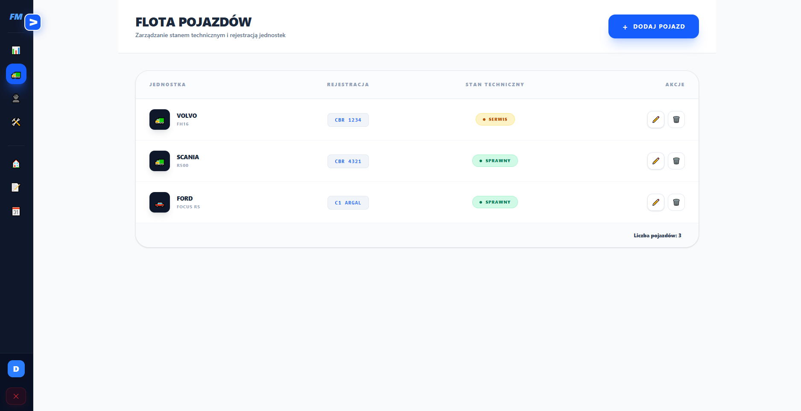
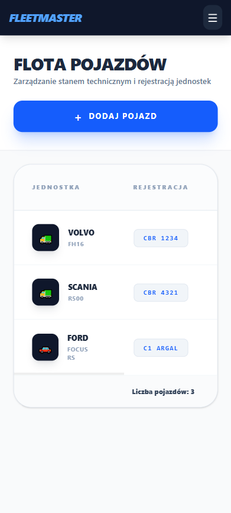
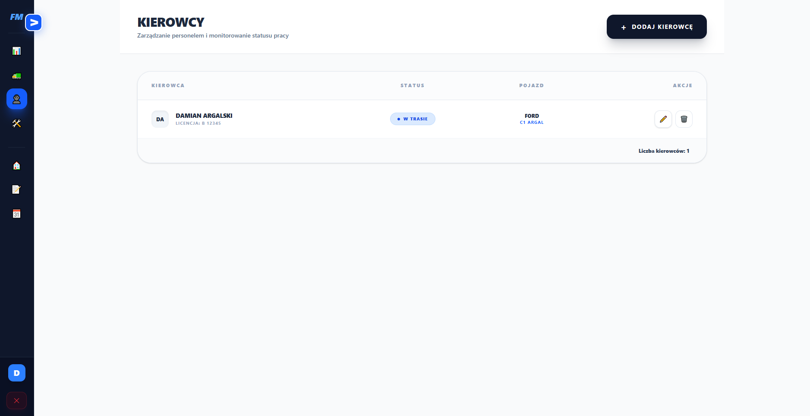
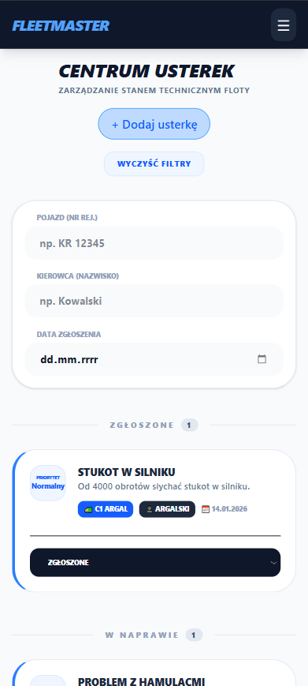
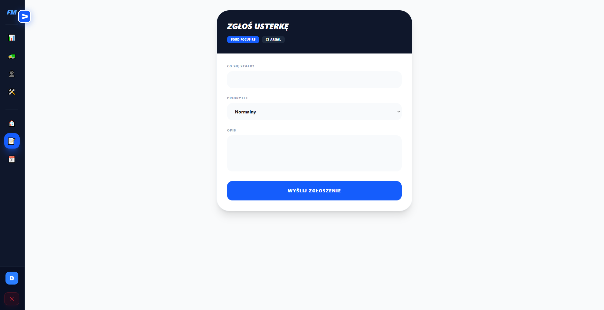
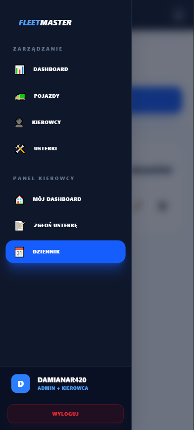

# FleetMaster – System Zarządzania Flotą

FleetMaster to webowa aplikacja umożliwiająca zarządzanie flotą pojazdów oraz pracą kierowców. System oferuje osobne panele dla administratora i kierowcy, a także funkcje ułatwiające obsługę pojazdów, raportowanie usterek oraz prowadzenie dziennika tras.

---

## 📸 Zrzuty ekranu

### 🔐 Logowanie

### 🧭 Dashboard
**Admin:**

**Kierowca:**

### 🚗 Zarządzanie pojazdami (admin)

**Widok mobilny:**

### 👥 Zarządzanie kierowcami (admin)

**Widok mobilny:**

### 🛠️ Usterki (admin i kierowca)

**Widok mobilny:**

**Zgłaszanie usterki (kierowca):**

**Widok mobilny:**

### 📘 Dziennik tras (kierowca)

**Widok mobilny:**

### 📱 Nawigacja mobilna

---

## ✨ Funkcje

### 🔑 Logowanie
- brak rejestracji — konta kierowców tworzy administrator
- konto administratora tworzone wyłącznie w bazie danych

### 👨‍💼 Funkcje administratora
- dodawanie pojazdów:  
  *typ, marka, model, numer rejestracyjny*
- dodawanie kierowców:  
  *imię, nazwisko, numer licencji, login i hasło*
- przegląd wszystkich usterek + możliwość dodawania nowych

### 👨‍🔧 Funkcje kierowcy
- zgłaszanie usterek przypisanego pojazdu
- dziennik tras:  
  *skąd → dokąd, dystans, czas*

---

## 🛠️ Technologie

### Frontend
- **Vue 3**
- **TypeScript**
- **Vite**
- **TailwindCSS**
- **Axios**

### Backend
- **.NET 8 (ASP.NET Core Web API)**
- **Entity Framework Core**
- **JWT Authentication**

### Baza danych
- **SQL Server**

---

---

# 🇺🇸
# FleetMaster – Fleet Management System

FleetMaster is a web application designed to manage vehicle fleets and drivers.  
It provides separate dashboards for admins and drivers, enabling vehicle handling, issue reporting, and route logging.

---

## 📸 Screenshots

### 🔐 Login

### 🧭 Dashboards
**Admin:**

**Driver:**

### 🚗 Vehicle Management (Admin)

**Mobile view:**

### 👥 Driver Management (Admin)

**Mobile view:**

### 🛠️ Issues (Admin & Driver)

**Mobile view:**

**Report Issue (Driver):**

**Mobile view:**

### 📘 Route Log (Driver)

**Mobile view:**

### 📱 Mobile Navigation

---

## ✨ Features

### 🔑 Login
- no user self-registration — drivers are added by the admin
- admin account must be created directly in the database

### 👨‍💼 Admin features
- add vehicles:  
  *type, brand, model, registration number*
- add drivers:  
  *first name, last name, license number, login & password*
- view all issues + create new ones

### 👨‍🔧 Driver features
- report issues for the assigned vehicle
- route log:  
  *from → to, distance, duration*

---

## 🛠️ Tech Stack

### Frontend
- **Vue 3**
- **TypeScript**
- **Vite**
- **TailwindCSS**
- **Axios**

### Backend
- **.NET 8 (ASP.NET Core Web API)**
- **Entity Framework Core**
- **JWT Authentication**

### Database
- **SQL Server**

---
